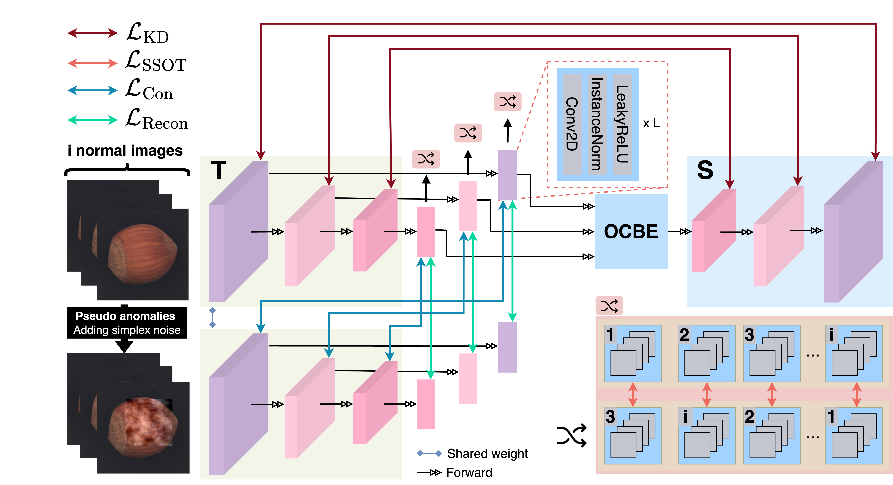
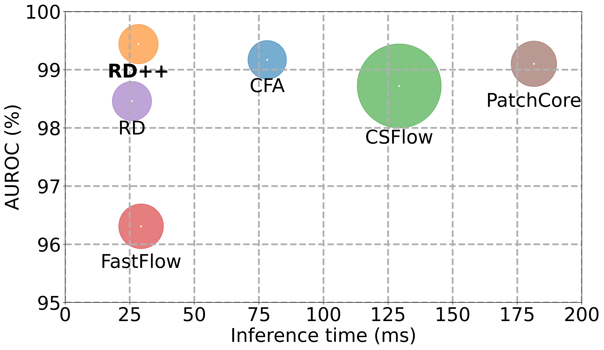

## Revisiting Reverse Distillation for Anomaly Detection (CVPR 2023)

Official code of CVPR 2023 paper: Revisiting Reverse Distillation for Anomaly Detection.

[](https://openaccess.thecvf.com/content/CVPR2023/papers/Tien_Revisiting_Reverse_Distillation_for_Anomaly_Detection_CVPR_2023_paper.pdf)
[](https://colab.research.google.com/github/tientrandinh/Revisiting-Reverse-Distillation/blob/main/main.ipynb)

<div align="center">

<br>
  
</div>

<!-- ## Abastract -->

&nbsp;&nbsp;&nbsp;&nbsp;The paper proposes the **RD++** approach for anomaly detection by enriching feature compactness and suppressing anomalous signals through a multi-task learning design. For the feature compactness task, RD++ introduces the self-supervised optimal transport method. For the anomalous signal suppression task, RD++ simulates pseudo-abnormal samples with simplex noise and minimizes the reconstruction loss. 
<br>&nbsp;&nbsp;&nbsp;&nbsp;RD++ achieves a **new state-of-the-art benchmark** on the challenging MVTec dataset for both anomaly detection and localization. **More importantly**, when compared to recent SOTA methods, RD++ runs **6.x times faster than PatchCore** and **2.x times faster than CFA**, while introducing a negligible latency compared to RD.

<div align="center">

<br>
  
</div>


## Table of Contents

- [Revisiting Reverse Distillation for Anomaly Detection (CVPR 2023)](#revisiting-reverse-distillation-for-anomaly-detection-cvpr-2023)
- [Table of Contents](#table-of-contents)
- [Libraries](#libraries)
- [Data Preparations](#data-preparations)
- [Train](#train)
- [Evaluation](#evaluation)
- [Quick Experiments](#quick-experiments)
- [Citation](#citation)
- [Acknowledgement](#acknowledgement)

## Libraries 
```       
- geomloss
- numba
```

or (preferably whithin a fresh env to avoid conflicts):
```bash
pip install -r requirements.txt
```
## Data Preparations
Download MVTEC dataset from [[Link]](https://www.mvtec.com/company/research/datasets/mvtec-ad)

## Train
To train and test the RD++ method on 15 classes of MVTEC, for example, with two classes: carpet and leather, please run:
```bash
python main.py --save_folder RD++  \
               --classes carpet leather

```
## Evaluation
If you only need to perform inference with checkpoints, please run:
```bash
python inference.py --checkpoint_folder RD++  \
                    --classes carpet leather
```
The pretrained weights can be found here  [[Google Drive]](https://drive.google.com/drive/folders/1ifrkexB0N1O87CpYPS-Wg2vgAiwXFf2Z)

## Quick Experiments

Try the Colab here using [](https://colab.research.google.com/github/tientrandinh/Revisiting-Reverse-Distillation/blob/main/main.ipynb)

## Citation
Please cite our paper if you find it's helpful in your work.

``` bibtex
@InProceedings{Tien_2023_CVPR,
    author    = {Tien, Tran Dinh and Nguyen, Anh Tuan and Tran, Nguyen Hoang and Huy, Ta Duc and Duong, Soan T.M. and Nguyen, Chanh D. Tr. and Truong, Steven Q. H.},
    title     = {Revisiting Reverse Distillation for Anomaly Detection},
    booktitle = {Proceedings of the IEEE/CVF Conference on Computer Vision and Pattern Recognition (CVPR)},
    month     = {June},
    year      = {2023},
    pages     = {24511-24520}
}
```

## Acknowledgement

We use [RD](https://github.com/hq-deng/RD4AD) as the baseline. Also, we use the [Simplex Noise](https://github.com/Julian-Wyatt/AnoDDPM). We are thankful to their brilliant works!


